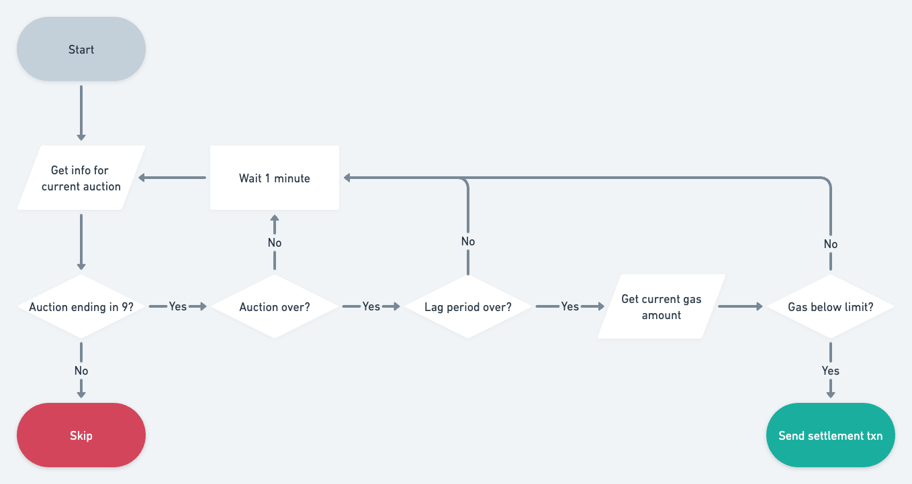

A script for settling Lil Nouns auctions when the following conditions are met:

- auction number ends in 9
- at least 15 minutes have passed since the auction ended
- gas is around or lower than 35 gwei

Lag period and gas limit are passed as enviroment variables in the wrangler.toml file. [Learn more about Lil Nouns](https://lilnouns.wtf).

